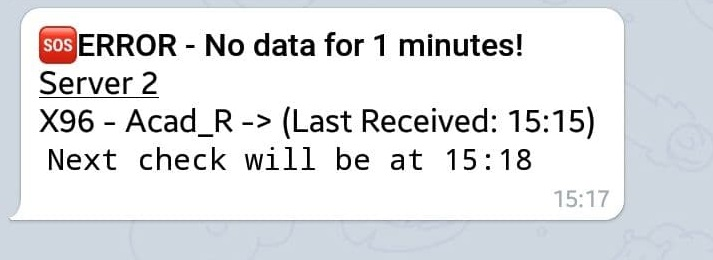
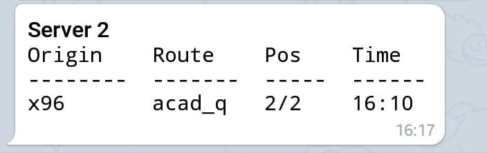

# MADevice

[](https://www.python.org/downloads/release/python-370/)

Provides a way to monitor devices being used in Telegram without needing a browser. Get alerts in Telegram when they have not updated for a set amount of time. As well as a way to get the status of your devices on demand.

## Requirements
* Python 3.7 (Only tested on 3.7, other Python 3 versions may work)

> WHERE IT SAYS `python[3[.7]]` or  `pip[3[.7]]` DON'T JUST COPY AND PASTE. EITHER RUN:
> * `pip` if you only have python 3 installed
> * `pip3` if you only have one python 3 installed
> * `pip3.7` if you have multiple python 3 installs.

## Setup
* Clone this repo
* You **MUST** create a virtual environment as this and MAD use different websocket versions.
   * Go to the folder containing MADevice. Within this folder run `python[3[.7]] -m venv py3`. This will create a folder within called `py3`
   * Within this there is a `bin` folder and in this there is the pip and python installs for this envrionment.
* Once you have a venv run from in the MADevice folder `<PATH_TO_VENV_BIN>/pip[3[.7]] install -r requirements.txt`
* Ensure you have entered your server details and name into `servers.json` (take a copy from `servers.json.example`)
    * This should be the `IP` and the `port`.
    * If you have set authentication for MADmin, ensure you add `username` and `password` to each of the servers in `servers.json`
    * specify your telegram id in the `telegram_channel_id` field for communication and receiving alerts
* Create `config.ini` from `config.ini.example` and populate the value which says `REQUIRED`
    * Optional config
        * `duration_before_alert` this is the number of minutes that MAD has not received any proto data for, before it raises an alert (Default: 20 minutes)
        * `delay_between_checks` this is the amount of time that MADevice does to sleep before checking the status of the devices again (Default: 20 minutes)

## Run

```
<PATH_TO_VENV_BIN>/python[3[.7]] main.py
```

### No Data Alert
When running it will check the last received time for data and then if it is more than 20 minutes (or the values set in `alert_recheck_time`) in the in the past it will post a message to  your telegram



### On-Demand Status (`/status`)

If you enter `/status` or `/satatus_all` in the chat with the bot from the account you specified in `telegram_channel_id`. You get an on-demand update across all servers (set in servers.json) and posted into Telegram rather than opening up multiple browsers to see the data.




## FAQ

### - How to get `telegram_channel_id`?

You can use a special Telegram bot, for example:
https://t.me/my_id_bot

### - How to create Telegram token?

https://core.telegram.org/bots

### - `Ctrl + C` does not stop MADevice
As of Python 3.6, the interpreter handles SIGINT generated by Ctrl+C differently for Linux and Windows.

See the below examples for how to stop the processes:
#### Mac OS and Linux

`Ctrl + Shift + \` or `Ctrl + \`

#### Windows

General: `Ctrl+Break`

Dell: `Ctrl+Fn+F6` or `Ctrl+Fn+S`

Lenovo: `Ctrl+Fn+F11` or `Ctrl+Fn+B`

HP: `Ctrl+Fn+Shift`

Samsung: `Fn+Esc`
